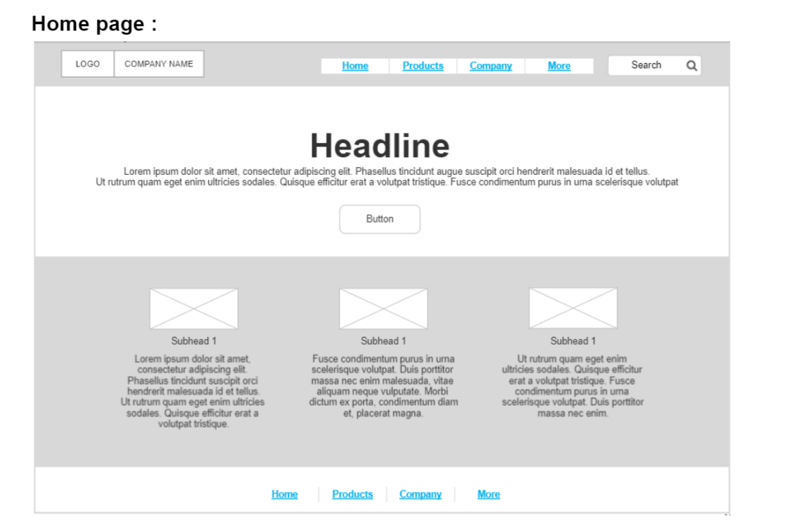
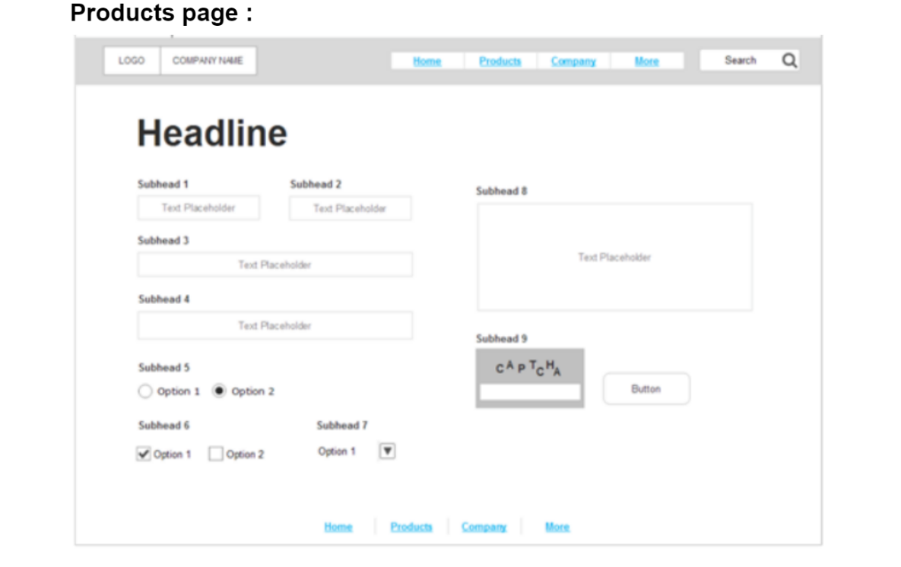
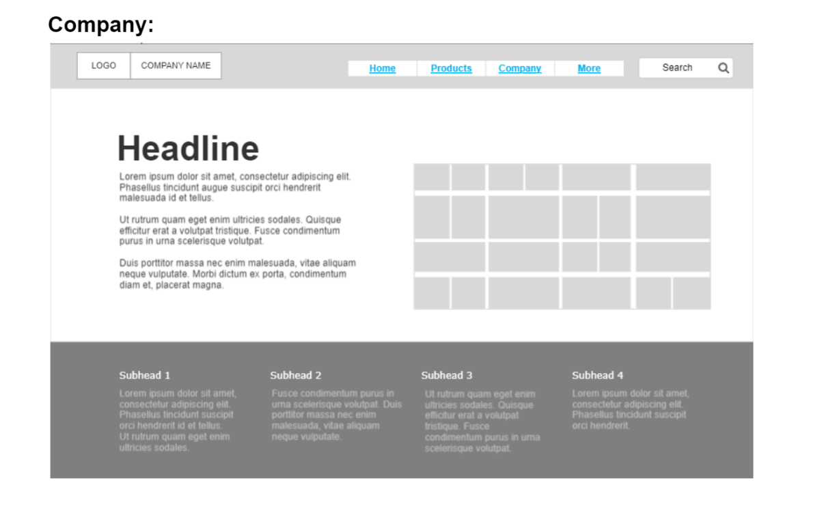
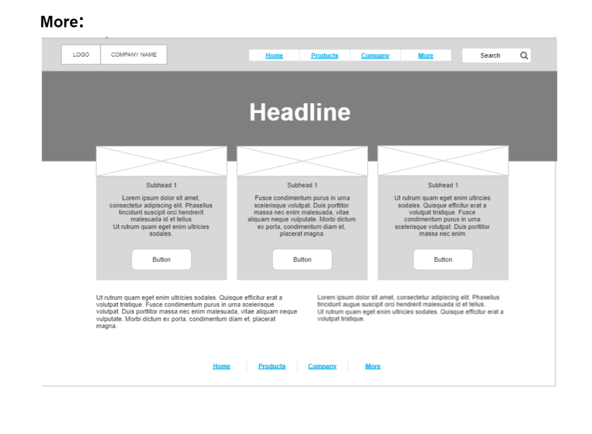

# wireframe2website
what is this project? 
Convert the provided Wireframe to HTML pages .
what are the tools you used to create it? using Figma online tool

The imge for the mockup and the wireframe:

